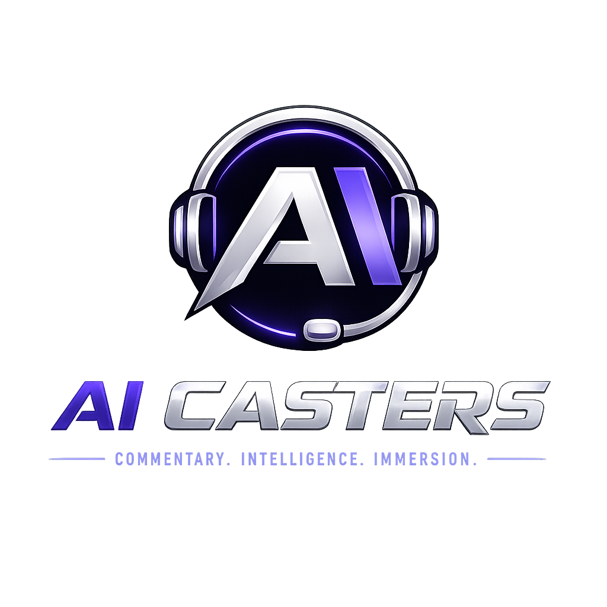

  

# AI Casters — Verification Checklist

Work top to bottom. **A–C** verify a build; **D** is the pre-broadcast operational
check before going live. Commands assume the repo root with the venv active.

---

## A. Environment & install

- [ ] Python 3.11+ available — `python --version`
- [ ] Virtual environment created and activated
- [ ] Base + UI installed — `pip install -e ".[ui,dev]"`
- [ ] Console script works — `ai-caster version` prints the version
- [ ] For a production box, the needed extras are installed
      (`capture`, `vision`, `ai`, `voice`, `obs`, `hotkeys`, `diagnostics`)

## B. Automated checks (must all pass)

- [ ] **Tests green** — `python -m pytest -q` → `316 passed`
- [ ] **Lint clean** — `ruff check src tests` → *All checks passed!*
- [ ] **Format clean** — `ruff format --check src tests`
- [ ] **UI byte-compiles** (Qt can't load headless) —
      `python -m compileall src/ai_caster/ui`
- [ ] **Package imports** — `python -c "import ai_caster.app"`
- [ ] **Brand logo packaged** —
      `python -c "from ai_caster.ui.assets import has_logo; assert has_logo()"`

## C. Subsystem smoke checks

Each maps to a milestone; the offline defaults make them all runnable with no
hardware.

- [ ] **Config/logging (M1)** — first run writes `settings.json`; `ai_caster.log`
      appears in the log dir
- [ ] **GSI receiver (M1)** — `ai-caster gsi-config` emits a valid `.cfg`; posting
      a payload updates **Live GSI**
- [ ] **Match/stats/detection (M2)** — a match produces model updates, an event
      feed and rows in `ai_caster.sqlite`
- [ ] **Capture (M3)** — the synthetic source runs; **Video Capture** shows FPS
      and a preview (real sources need the `capture` extra)
- [ ] **Vision (M4)** — enabling vision yields scene/cue confidences; GSI is never
      overridden
- [ ] **Director + replay (M5)** — directives appear; during a replay, live
      play-by-play is silenced
- [ ] **Commentary AIs (M6)** — the Mock provider emits play-by-play + analyst
      lines from match facts (real LLMs need the `ai` extra)
- [ ] **Voice + OBS (M7)** — lines drive both voice channels + the monitor mix; a
      replay flips the OBS scene (offline null sinks/controller by default)
- [ ] **Accounts/licensing/updates/sync (M8)** — sign in offline; license resolves
      to a tier; update check + cloud-sync gating behave
- [ ] **Broadcast/hotkeys/diagnostics (M9)** — **Go live** starts capture+vision;
      hotkeys toggle casting/mute/replay; Diagnostics publishes snapshots
- [ ] **Training pipeline (M10)** —
      `ai-caster train <dir>` refuses audio-bearing/unauthorized files and writes a
      names-free profile

## D. Pre-broadcast operational check (before going live)

- [ ] CS2 running, observing a match; **Dashboard → GSI feed = Connected**
- [ ] Capture source points at the real observer feed; **Video Capture** preview
      looks correct
- [ ] Vision enabled if wanted; replay-banner region matches your overlay
- [ ] Commentary provider selected (Mock, or a real key under **Settings → AI**)
- [ ] Each voice assigned to the intended output device; monitor mix audible in
      your headphones; levels/limiter sane
- [ ] OBS WebSocket connected; live/replay scenes named correctly; auto-switch on
- [ ] Hotkeys respond (toggle casting / mute all / force replay)
- [ ] Signed in; tier includes **live casting**; license shows **active** (or valid
      offline cache)
- [ ] **Diagnostics** healthy: expected FPS, low drop rate, CPU/memory in range,
      voice queues draining
- [ ] Press **Go live** — both voices speak, replays switch scenes and are never
      described as live

> Tip: keep the **Diagnostics** view open during long sessions and watch drop rate
> and voice queue depth — the honest early-warning signals for a stressed box.
